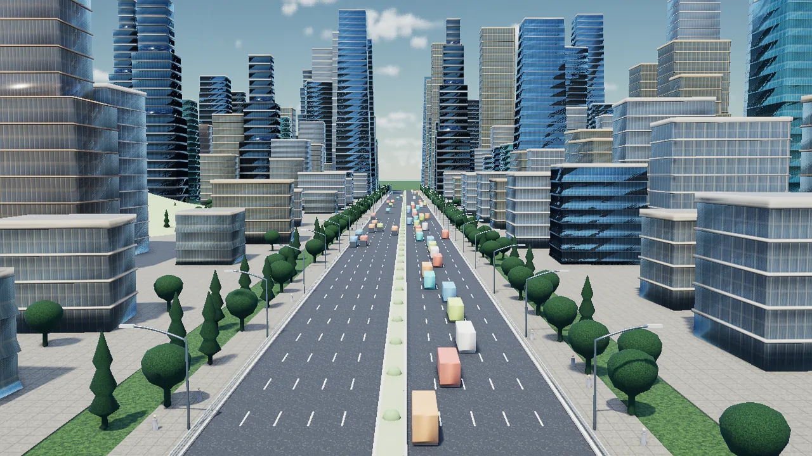
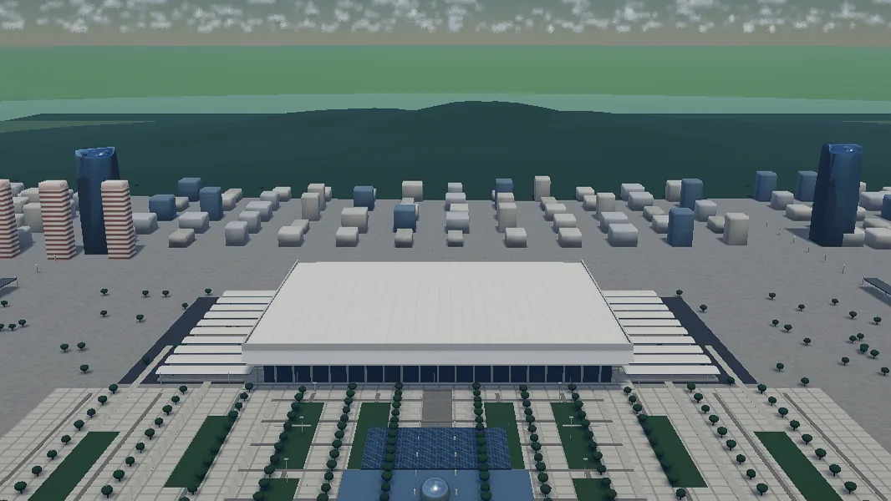
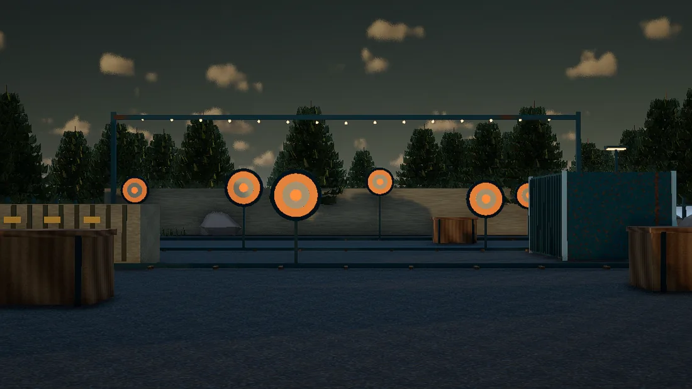

# SSWorld

*[English](README.md)*

**Agent 看不见自己渲染出了什么。SSWorld 把这个环闭上。**

[](examples/SkylineBoulevard)

一个 MCP 服务器,让任何支持 MCP 的 agent 应用(Claude Code、Codex、Hermes、Cursor …)用 **SSDL**
——一种类 QML 的场景描述语言——在 **SSEngine WebGPU** 运行时上写场景、编译、渲染,并且**回读**渲染结果。
上面这张图就是 agent 写出来的场景,生成它的 42 KB Python 在
[`examples/SkylineBoulevard`](examples/SkylineBoulevard)。

## 和"又一个场景生成器"的区别

- **是真引擎,不是预览。** 延迟渲染、大气天空、阴影、后处理、glTF 资产、GPU 实例化、地理锚定。
  几十万个实例化对象的场景跑在 60 fps。
- **Agent 能拿到画面本身。** `ssworld_capture_frame` 经引擎渲染,回传亮度分位数、曝光尾部、
  3×3 分区的颜色覆盖、主色列表、实际使用的相机位姿与请求位姿的偏差,以及一份把这一帧绑定到
  源码摘要和应答页面的回执。Agent 能自己发现"天空糊成橙褐色了"并改掉,不需要人盯着看。
- **真机上踩过的坑变成编译错误。** 下面每一条都是先在真实硬件上踩到的,当时的症状是白页 + 日志什么都没有。
  现在每一条都在编译期点名节点和成员:用 `rayleighScattering` 给天空调色、`Lathe` 半径写 0、
  给没有切线的几何加 `normalMap`、`heights` 按格子数而不是角点数来数。

## 案例

| [SkylineBoulevard](examples/SkylineBoulevard) | [ShenzhenNorthStation](examples/ShenzhenNorthStation) | [DuskRange](examples/DuskRange) |
|---|---|---|
| [](examples/SkylineBoulevard) | [](examples/ShenzhenNorthStation) | [](examples/DuskRange) |
| 程序化生成的都会大道。42 KB 确定性 Python 生成 306 KB SSDL。 | 按国铁公开尺度重建的真实车站,对照航拍参考逐轮打磨。 | 可玩的 75 秒移动靶射击:键盘输入、命中计分、HUD、碰撞。 |

三个案例都**只收手写源**——贴图和 `scene.ssdl` 由脚本重新生成——所以每个都不到 250 KB,
且不含任何第三方素材。详见 [`examples/`](examples)。用到第三方模型的场景放在 showcase 仓库,
并在那里附署名。

## 安装(一条命令)

```bash
npx -y github:DataArche/SSWorld install
```

这会全局安装本包、把 `ssworld` MCP 服务器注册进它能找到的每个 agent 应用
(用 `--client=claude,codex,hermes,cursor` 指定),并把钉死版本的引擎(约 54 MB)下载到 `~/.ssworld/engine/`。

环境要求:Node.js ≥ 22、npm,以及一个支持 WebGPU 的浏览器(Chrome/Edge)用来看预览。

手动注册到其他客户端:

```json
{ "mcpServers": { "ssworld": { "command": "node", "args": ["<npm root -g>/ssworld-mcp/bin/ssworld-mcp.mjs"] } } }
```

## 工具

十三个工具。下表是一句话版本;每个工具的完整行为(参数、分页、回执字段、诚实信号)见
[英文 README](README.md#tools)。

| 工具 | 作用 |
|------|------|
| `ssworld_catalog` | 组件索引 / 单个契约 / 批量契约;带 `catalog_digest` 做缓存命中,每个成员标注单位与旋转约定 |
| `ssworld_project_list` | 列出 `~/.ssworld/projects` 下的项目 |
| `ssworld_project_create` | 新建一个可运行项目(按经纬高锚定)并编译 |
| `ssworld_source_read` / `ssworld_source_write` | 有界读取(`max_chars`、偏移分页、`mode: metadata` 只要摘要和编译新鲜度、`node` 只要一个块)与整文件写入 |
| `ssworld_source_patch` | 精确跨度替换(`old_string` → `new_string`,查唯一性),带同一套摘要锁 |
| `ssworld_source_batch` | 原子多处编辑:文本补丁 + 节点级 `{node_id, set, unset}`;全部先在内存校验,`validate: compile` 失败时回滚 |
| `ssworld_scene_inspect` | 不渲染就拿到编译后场景的事实:预算占比、按体量排序的子树、每种类型的叶子、图元范围、请求的相机 |
| `ssworld_compile` | SSDL 0.3 编译器,真实诊断、节点数、预算 `usage` 和 `logic`;目录与运行时的不一致是编译错误 |
| `ssworld_preview` | 起本地预览服务器,返回页面地址、页面是否打开、`page.clients`(每个同步中的浏览器)和结构化的 `next` |
| `ssworld_capture_frame` | 经引擎截图 + 统计量 + 相机偏差 + 回执 + 页面实时逻辑;`await` 可等某个状态成立再拍;`detail: "brief"` 供迭代循环 |
| `ssworld_environment_read` | 问引擎它实际收到的环境:从原生太阳回读的方向、哪个 `DirectionalLight` 在驱动大气、各环境组件的实时原生值 |
| `ssworld_logic_read` / `ssworld_logic_write` | 不截图就读页面的场景逻辑(含场景模块到底有没有挂载),或在一个事务里设置声明属性,把游戏摆到某个局面再截图 |
| `ssworld_engine_status` | 引擎配对装好了没(`install: true` 触发下载) |

## 规模:实测到哪里为止

预算是每个项目 `showcase.manifest.json` 里的值。默认值:4096 原生对象 / 4096 材质壳 / 32 张不同图片 /
4096 绑定 / 2048 处理器 / 256 计时器 / 256 时间线 / 1024 个 Group locator / 1024 个 Prefab /
524288 个实例行。其中四项是引擎自己的上限,manifest 抬不动——抬了会编译通过然后挂不上去。

**先用完的不是渲染,是截图。** 6401 个原生对象 + 200 个 prefab 上的 409600 个实例行:编译 1.2 s、
挂载 4.0 s、61 fps、零运行时错误。但离屏回读在 4001 个原生对象(能截)和 5001 个(不能)之间死于
wasm "memory access out of bounds"。所以大约 4000 节点以上的场景能跑但不能截图,这也是为什么
**实例化**(200 个原生对象承载 409600 行)才是做大场景的办法。

三条引擎上限没有预算维度,各自是独立的编译错误:`scene_depth_exceeded`(16 层嵌套)、
`model_budget`(64 个 `Model` 挂载——多处摆放要用 `Prefab` 而不是复制)、
`texture_budget`(64 MiB 不同图片,不论单个文件多小)。

完整的测量记录和"绑定 64 条墙"那段历史见[英文 README](README.md#how-big-a-scene-measured)。

## 写场景要知道的几件事

- **颜色按 sRGB 写。** `#rrggbb` 就是取色器给你的值,运行时转成线性再交给引擎。原生材质每通道只有
  8 bit *线性*光,所以很暗的颜色会量化:`#16260f` 回读是 `#16260d`,`#0a0a0a` 以下基本塌成黑。
- **列表值可以跨行**(`sections: [` 后换行、一行一个环、括号内可写注释),但属性仍然到换行或 `;` 结束,
  所以跨行只在 `[ ]` 内部成立。
- **程序化几何**有四个参数化生成器:`HeightField`(`columns`/`rows` 数格子,`heights` 数它们周围的
  `(columns+1)*(rows+1)` 个角点,行主序从 `-depth/2` 开始)、`Lathe`、`Tube`、`Loft`。
  任意网格走托管资产(`Model`)。
- **模型资产**:glb 和贴图放进 `<project>/assets/`,按项目相对路径引用。单个 glb 上限 32 MiB、
  单张贴图 8 MiB、每项目 64 个资产。Model 自带材质,只有它的位置/旋转/缩放/可见性可动画。
- **场景逻辑**:在 `Scene` 根上声明属性,处理器赋值(一个处理器一个事务),绑定读取。
  宿主 JavaScript 只能通过 `host_interfaces.json` 声明的调用进入,对不上就是编译错误。
- **绑定整批回滚**:任何一个被目标拒绝的值会让整批回滚、绑定转为无效,页面报 `binding_error`
  并映射到那个节点块里的成员行。

每一条的完整说明(包括编译器具体拒什么、为什么拒)见[英文 README](README.md#authoring-reference)。

## 命令行

```
ssworld-mcp                 # MCP stdio 服务器(agent 应用启动的就是它)
ssworld-mcp install [--client=claude,codex] [--no-engine]
ssworld-mcp engine          # 下载 / 校验钉死版本的引擎
ssworld-mcp preview [--port=8880]
ssworld-mcp doctor
```

环境变量:`SSWORLD_HOME`(默认 `~/.ssworld`)、`SSWORLD_PREVIEW_PORT`(8880)、
`SSWORLD_ENGINE_DIR`(用本地引擎配对,不走 release 下载)。

## 目录

`ssdl/compiler` 是逐字节一致的 SSDL 0.3 编译器闭包,`ssdl/runtime` 是浏览器运行时,
`ssdl/catalog` 是组件目录,`engine.lock.json` 钉住作为 GitHub Release 资产发布的
SSmap.js/SSmap.wasm 配对。本仓库由 SSEngine3 仓库里的 `src/ssdl/tools/pack_ssworld_mcp.py` 生成,
不要直接在这里改。

## 许可

刻意分成两轨。

MCP 服务器、SSDL 编译器、浏览器运行时、组件目录、项目模板和技能是 **Apache-2.0**(`LICENSE`)——
可以读、可以 fork、可以拿去发布。

渲染引擎(`engine/SSmap.js`、`engine/SSmap.wasm`,由安装器下载,从不入库)是**专有**的,
条款在 `ENGINE-LICENSE.txt`,授予免费使用和二进制形式的再分发,包括商业用途。
`NOTICE` 逐文件写清这个划分,以及第三方组件(`qtloader.js` 是 Qt 的,依它自己的条款)。
