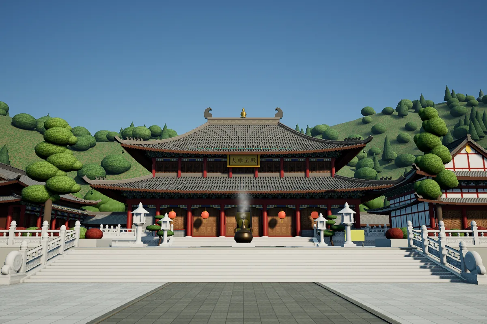

# Daxiong Hall

A Chinese Buddhist temple courtyard around a Mahavira Hall (Daxiong Baodian), built entirely in SSDL: a seven-bay, double-eaved main hall with curved roofs, bracket sets and painted beams, a raised white-marble terrace with balustrades and a twelve-step front stair, side halls, a corridor, a bronze incense burner with rising smoke, lanterns, sculpted pines and a wooded hillside behind.



A concept model designed from a reference photograph — the photograph is not included, and the hall is not a measured survey of any real building. The anchor (121.55 E, 29.87 N) only places the scene on the globe.

## How it is made

One script, `gen_scene.py`, writes **every** `.ssdl` file and every texture from one set of dimensions (x east, y north, z up, metres; the camera side is south). Nothing is typed by hand into the scene sources and no third-party model is used:

- Roofs, rolls and eave ends are generated meshes (`HallRoof.ssdl`, `HallRolls.ssdl`), with pantiles, rafters and ridge ornaments.
- Doors, windows, lattices, painted beams, the plaque, brick and stone are procedural textures drawn with Pillow.
- Repeated parts — bracket sets, balustrade posts, lanterns, trees — are `Prefab` + `Instances` batches.
- The incense smoke is a `ParticleEmitter` with a greyscale sprite read as luminance, with a darker copy after dusk so the unlit particles do not glow.

The page adds a cinema layer (`cinema.js`) with eight camera presets (the reference-photo viewpoint, the hall front, the plaque, the eaves and brackets, the balustrade, the east and west halls and an aerial view), a choreographed tour, time-of-day presets, hide-UI, fullscreen and screenshots. It moves the camera only through the scene's declared camera properties, so the SSDL stays the single source of truth.

## Reproduce

```bash
# 1. let the server create the project (this writes the page shell)
#    via your agent: ssworld_project_create {"name":"DaxiongHall0924","longitude":121.55,"latitude":29.87,"height":10}
# 2. copy this directory over it
cp -r DaxiongHall0924/* ~/.ssworld/projects/DaxiongHall0924/
cd ~/.ssworld/projects/DaxiongHall0924
# 3. write every .ssdl, texture and the camera preset table (cinema-shots.js)
python gen_scene.py                  # needs Pillow and NumPy
# 4. in your agent: ssworld_compile, then ssworld_preview
```

The script only replaces files whose bytes changed (via an atomic rename), so the running preview never reads a half-written file. The plaque characters are drawn with KaiTi or HeiTi from the Windows font folder (`simkai.ttf` / `simhei.ttf`); without either font the plaque is left blank.

## Files

| File | Role |
|---|---|
| `gen_scene.py` | The generator: dimensions, meshes, textures, components, `scene.ssdl`, `cinema-shots.js` |
| `index.html` | The preview page with the cinema layer mounted |
| `cinema.js` | Camera presets, tour, time presets, hide-UI, fullscreen, screenshots |
| `showcase.manifest.json` | Project anchor and budgets |

## Honest limits

Stylised concept architecture: proportions follow the generator's dimension table, not a survey, The particles are unlit sprites; there is no audio and no interaction beyond the camera.
