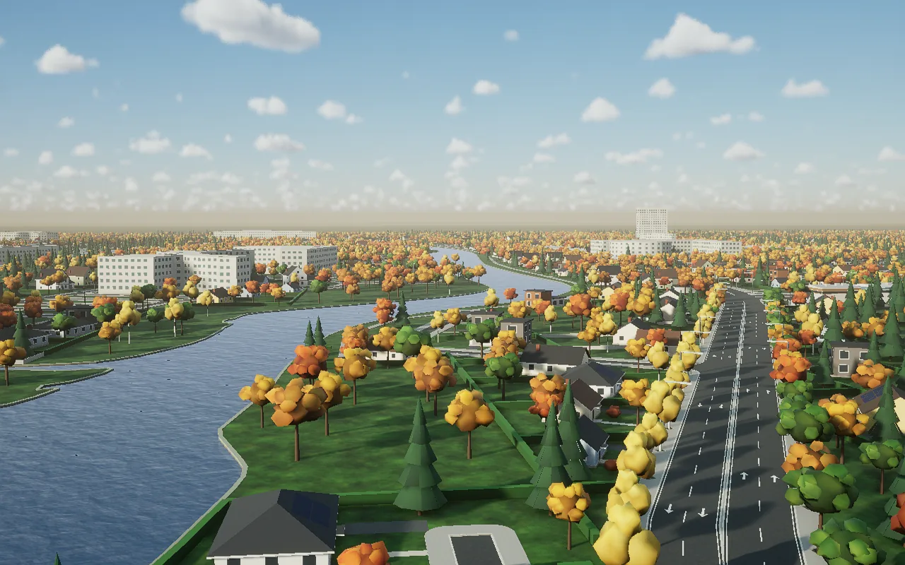

# Guanlan Road Template

A real street network in Guanlan, Shenzhen (3.28 km², 114.035–114.051 E / 22.690–22.708 N), rebuilt from OpenStreetMap into an interactive SSWorld scene: carriageways with rounded corners and curbs, sidewalks, markings and crossings, a river channel with water, indicative parcels and houses, street trees, woodland and lamps.



The whole scene comes out of one config and one fixed pipeline, so this example is a **generator, not a scene**: `tools/road_template/` turns any bbox of OSM data into the same kind of street scene, and `configs/guanlan.json` is this site.

## What the Guanlan build contains

- 188 mapped roads, 182 junctions, 26 mapped and 109 inferred crossings.
- 140 blocks cut into 1,333 illustrative parcels; 952 indicative houses and 41 workshops on them.
- 91 OSM building footprints with inferred heights.
- 3,170 street trees, 15,000 woodland trees and 656 lamps, all as `Instances` batches filled from `logic.mjs`.
- One river channel with a `WaterMaterial` surface.
- All 11 geometry checks at zero (no road/sidewalk/building/parcel overlaps, no markings off the carriageway, every parcel with frontage, water covering its channel).

## Reproduce

```powershell
# 0. the street lamps reuse the SkylineGarden0919 lamp model: generate that example first
cd ..\SkylineGarden0919; python generate.py --detail; cd ..\GuanlanRoadTemplate0924
# 1. Shapely + NumPy for the geometry stage
python -m pip install --target .deps/guanlan-gis shapely==2.1.2 numpy
# 2. fetch OSM, project with the engine, generate, compile and sync to ~/.ssworld/projects/GuanlanRoadTemplate0924
./tools/road_template/new_site.ps1 -Config tools/road_template/configs/guanlan.json
```

The SSWorld preview service must be running (`ssworld_preview`). Stage 2 converts coordinates inside a headed Chrome page because the projection uses only the engine's native API. The full pipeline, config reference and tuning notes are in [`tools/road_template/README.md`](tools/road_template/README.md).

For another site, copy `configs/template.json`, set `name`, `bbox`, `anchor` and the data paths, and run the same command.

## What is not here

The downloaded OSM data, the projection cache, the generated glb meshes (about 89 MB for Guanlan), the SSDL components and the page are all build products of the pipeline, and are left out.

## Honest limits

This is a planar design reference with no DEM. Road widths and cross-sections are inferred unless tagged; parcels, houses, yards, trees and lamps are indicative design, not cadastral or surveyed data; bridges are guides only. It is not a road-engineering model or a traffic simulation.

## Data licence

Geographic data © OpenStreetMap contributors, available under the Open Database License (ODbL): https://www.openstreetmap.org/copyright. The street-lamp model comes from SkylineGarden0919; every other mesh and texture is generated by the scripts here.
