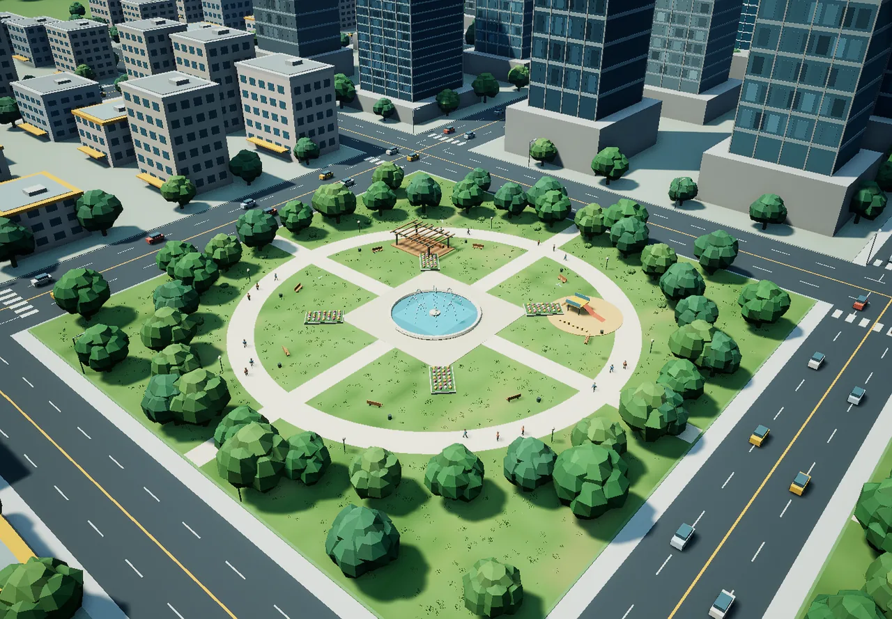

# Skyline Garden

An original procedural city on SSWorld / SSDL / SSEngine WebGPU: a downtown of towers and two landmarks, low-rise neighbourhoods, four parks, a river, an elevated road and a rail line, with traffic, signals, a train, park life, fountains and a full day–night cycle.



A concept city inspired by a single reference image; the reference is not included and nothing is calibrated to real dimensions. The design covers about 1.6 × 1.4 km. The geographic anchor (114.055 E, 22.533 N) only places the scene; it is not a model of the real district there.

## What it contains

- 194 buildings on 30 lots, four parks and two landmarks; 4 tower types and 6 low-rise prototypes.
- About 6,700 trees, 351 cars circulating on six closed lane routes, 42 signalised junctions, lamps, markings, an elevated road with piers and a double rail track with a four-car train.
- Parks with ring paths, fountains made of native `ParticleEmitter`s, flower beds, benches, playgrounds, 72 walking people and 12 circling birds.
- A designed terrain of four `HeightField` tiles, textured lawn, grass tufts, shrubs and rocks.
- Day–night: an `Environment` clock, 134 real street and garden `PointLight`s that dim in and out at dusk and dawn, 4,315 glowing windows, and day/night car models whose head- and tail-lamps are baked as emissive primitives.
- Every glb is an original model written by the scripts here; no downloaded models or map services.

## Controls

Camera presets 01 overview / 02 plan / 03 business core / 04 street / 05 park life; left-drag pans, right-drag rotates, wheel zooms, reset returns to the current preset. The page has a 00:00–24:00 time slider with day/night shortcuts, the design-layout panel, one pause for cars and train and a separate pause for the park animation.

## Reproduce

```bash
# 1. let the server create the project (this writes the page shell)
#    via your agent: ssworld_project_create {"name":"SkylineGarden0919","longitude":114.055,"latitude":22.533,"height":20}
# 2. copy this directory over it
cp -r SkylineGarden0919/* ~/.ssworld/projects/SkylineGarden0919/
cd ~/.ssworld/projects/SkylineGarden0919
# 3. generate every component .ssdl, scene.ssdl, the glb assets and textures (Python standard library only)
python generate.py --detail          # without --detail: the massing draft only
# 4. build index.html from viewer-template.html
node build-viewer.mjs
# 5. in your agent: ssworld_compile, then patch the generated scene host and open the preview
node patch-scene-host.mjs            # re-run after every compile
```

Generation is deterministic (fixed seeds): the same scripts produce the same files. `generate.py --detail` calls the other generators in turn.

## Files

| File | Role |
|---|---|
| `generate.py` | Layout, buildings, roads, rail, trees, traffic; writes `scene.ssdl` and the core components |
| `terrain_form.py`, `terrain_assets.py` | Terrain heights and park clearances; lawn textures, grass tufts, rocks, `TerrainDetails.ssdl` / `GroundCover.ssdl` |
| `park_assets.py`, `park_gardens.py`, `fountain_assets.py` | Park furniture, people, birds, planting, particle fountains |
| `intersections.py` | 42 junctions: zebra crossings, stop lines, signals |
| `night_lighting.py`, `window_lighting.py` | Street/garden lights, glowing windows |
| `tree_density.py` | Deterministic extra planting layer |
| `VehiclePointLights.ssdl` | The one hand-written component: a spawnable car head-lamp |
| `logic.mjs`, `traffic-motion.mjs`, `park-motion.mjs`, `car-point-lights.mjs` | Traffic routes, signals and train; park motion; the nearest-48 car head-lamp budget |
| `host_interfaces.json` | The host calls the SSDL timers make |
| `viewer-template.html`, `style.css`, `time-controls.mjs`, `fps-meter.mjs`, `build-viewer.mjs` | The showcase page and its builder |
| `patch-scene-host.mjs` | Adds two host extensions (batched light positions, live camera) to the compiled `scene.mjs` |
| `*.test.mjs` | `node traffic.test.mjs`, `signals.test.mjs`, `park.test.mjs`, `car-lights.test.mjs` |

## Simulation notes

- Traffic: up to about 28.8 km/h, 8 m turning radius, right-hand outer lane, acceleration and braking, stop lines and a 7.2 m minimum headway, no overtaking. Signals run a synchronised 36 s cycle (12 s green, 3 s amber, 3 s all-red per axis). The simulation steps at a fixed 50 ms internally, so the result does not depend on the 100 ms host tick. Pausing freezes cars, signals and the train and does not catch up afterwards.
- Car head-lamps: 351 spawnable point lights, but only the 48 nearest the camera are lit; cars that moved less than 5 cm are not rewritten.
- Fountains: 68 CPU sprite emitters with gravity arcs, capped at 5,472 particles; the park pause stops both emission and playback.

## Honest limits

Fixed-route traffic only: no path-finding, rigid-body collision, crowd avoidance, pedestrian crossings or adaptive signal timing. Lights are real-time but cast no local shadows, and their intensities are tuned by eye, not measured illuminance. Designed terrain, not a DEM. `render_verified` proves the scene rendered; it says nothing about matching the reference image.
